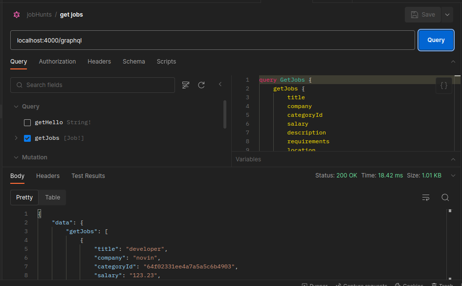
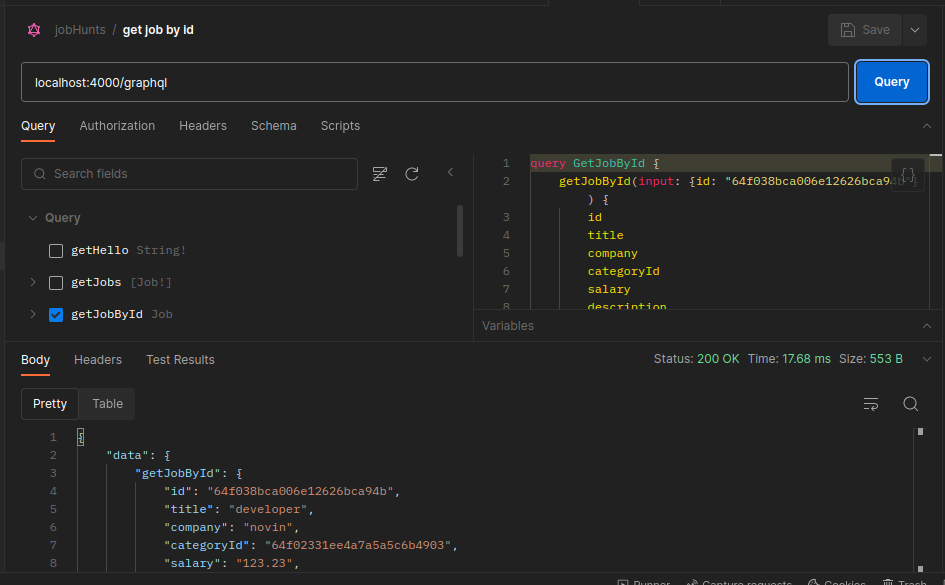

# JobHunt - Open Source Job Board Platform in TypeScript

JobHunt is an open-source job board platform that enables employers to post job listings and job seekers to search and apply for jobs. The platform is built using Express.js and GraphQL, making it efficient and flexible for managing job-related interactions. This repository contains the source code for JobHunt, and we welcome contributions from the community to enhance its features and capabilities.

## Features

- **Employer Dashboard:** Employers can easily create accounts, log in, and post job listings.
- **Job Seeker Profile:** Job seekers can create profiles, search for jobs, and apply using their profiles.
- **Job Listings:** Display job listings with detailed descriptions, requirements, and application instructions.
- **Application Tracking:** Employers can track and manage job applications through the dashboard.
- **GraphQL API:** Utilize a powerful GraphQL API for seamless job listing retrieval and user interactions.
- **Responsive Design:** A responsive and user-friendly interface accessible on various devices.
- **Open Source:** JobHunt is open source, allowing you to customize and contribute to its development.

## Installation

Follow these steps to set up and run JobHunt locally on your machine:

Clone the repository:

```bash
git clone https://github.com/BaseMax/JobHuntTS.git
```

Navigate to the project directory:

```bash
cd JobHuntTS
```

Install dependencies:

```bash
npm install
```

Configure environment variables:

Rename `.env.example` to `.env` and fill in your environment variables.

Run the development server:

```bash
npm run dev
```

Open your browser and visit `http://localhost:3000` to access JobHunt.

## GraphQL

| Type         | Name                      | Description                                      | Example                                                                                |
| ------------ | ------------------------- | ------------------------------------------------ | -------------------------------------------------------------------------------------- |
| **Query**    | `getJobs`                 | Get a list of all available jobs.                |                                         |
| **Query**    | `getJobById`              | Get details of a specific job by its ID.         |                                          |
| **Query**    | `getJobByTitle`           | Search for jobs by title.                        | `getJobByTitle(title: "Software Engineer")`                                            |
| **Query**    | `getJobByCategory`        | Filter jobs by category.                         | `getJobByCategory(category: "Engineering")`                                            |
| **Query**    | `getFeaturedJobs`         | Get a list of featured job listings.             | `getFeaturedJobs { title, company }`                                                   |
| **Query**    | `getUserProfile`          | Get the profile of a specific user.              | `getUserProfile(username: "john_doe")`                                                 |
| **Query**    | `getUserApplications`     | Get applications...                              | `getUserApplications(userID: "userID")`                                                |
| **Mutation** | `createJobListing`        | Create a new job listing.                        | `createJobListing(input: { title, ... })`                                              |
| **Mutation** | `updateJobListing`        | Update details of an existing job listing.       | `updateJobListing(id: "jobID", input: { title, ... })`                                 |
| **Mutation** | `deleteJobListing`        | Delete a job listing by its ID.                  | `deleteJobListing(id: "jobID")`                                                        |
| **Mutation** | `applyForJob`             | Apply for a job listing using user's profile.    | `applyForJob(jobID: "jobID", userID: "userID")`                                        |
| **Mutation** | `withdrawApplication`     | Withdraw a job application by its ID.            | `withdrawApplication(applicationID: "appID")`                                          |
| **Mutation** | `createUserProfile`       | Create a new user profile.                       | `createUserProfile(input: { username, ... })`                                          |
| **Mutation** | `updateUserProfile`       | Update user profile details.                     | `updateUserProfile(userID: "userID", input: { bio, ... })`                             |
| **Mutation** | `deleteUserProfile`       | Delete a user profile by its ID.                 | `deleteUserProfile(userID: "userID")`                                                  |
| **Mutation** | `acceptApplication`       | Accept a job application for a listing.          | `acceptApplication(applicationID: "appID")`                                            |
| **Mutation** | `rejectApplication`       | Reject a job application for a listing.          | `rejectApplication(applicationID: "appID")`                                            |
| **Query**    | `getCategories`           | Get a list of all available job categories.      | `getCategories { id, name }`                                                           |
| **Query**    | `getUsers`                | Get a list of all registered users.              | `getUsers { id, username }`                                                            |
| **Query**    | `getApplications`         | Get all job applications for a job listing.      | `getApplications(jobID: "jobID") { id, user }`                                         |
| **Mutation** | `createCategory`          | Create a new job category.                       | `createCategory(name: "Design")`                                                       |
| **Mutation** | `updateCategory`          | Update a job category's details.                 | `updateCategory(id: "catID", name: "New Name")`                                        |
| **Mutation** | `deleteCategory`          | Delete a job category by its ID.                 | `deleteCategory(id: "catID")`                                                          |
| **Query**    | `getSimilarJobs`          | Get a list of jobs similar to a given job.       | `getSimilarJobs(jobID: "jobID") { id, title, company }`                                |
| **Query**    | `getRecentJobs`           | Get a list of recently posted job listings.      | `getRecentJobs { title, company }`                                                     |
| **Query**    | `getJobCountByCategory`   | Get the number of jobs in a specific category.   | `getJobCountByCategory(category: "IT")`                                                |
| **Mutation** | `addBookmark`             | Add a job listing to a user's bookmarks.         | `addBookmark(userID: "userID", jobID: "jobID")`                                        |
| **Mutation** | `removeBookmark`          | Remove a job listing from a user's bookmarks.    | `removeBookmark(userID: "userID", jobID: "jobID")`                                     |
| **Mutation** | `createReview`            | Create a review for a specific job listing.      | `createReview(jobID: "jobID", userID: "userID", rating: 4, content: "Great company!")` |
| **Mutation** | `updateReview`            | Update a review's content or rating.             | `updateReview(reviewID: "reviewID", content: "Updated review")`                        |
| **Mutation** | `deleteReview`            | Delete a review by its ID.                       | `deleteReview(reviewID: "reviewID")`                                                   |
| **Mutation** | `rateReview`              | Rate a review as helpful or unhelpful.           | `rateReview(reviewID: "reviewID", helpful: true)`                                      |
| **Query**    | `getBookmarkedJobs`       | Get a list of jobs bookmarked by a user.         | `getBookmarkedJobs(userID: "userID") { id, title, company }`                           |
| **Query**    | `getReviewsForJob`        | Get all reviews for a specific job listing.      | `getReviewsForJob(jobID: "jobID") { id, rating, content }`                             |
| **Query**    | `getTopCategories`        | Get the most popular job categories.             | `getTopCategories(limit: 5) { name, jobCount }`                                        |
| **Query**    | `getUserBookmarkCount`    | Get the number of bookmarks for a user.          | `getUserBookmarkCount(userID: "userID")`                                               |
| **Mutation** | `createApplication`       | Create a new job application.                    | `createApplication(userID: "userID", jobID: "jobID")`                                  |
| **Mutation** | `updateApplication`       | Update details of a job application.             | `updateApplication(applicationID: "appID", input: { status: "Reviewed" })`             |
| **Mutation** | `deleteApplication`       | Delete a job application by its ID.              | `deleteApplication(applicationID: "appID")`                                            |
| **Query**    | `getJobsWithApplications` | Get a list of jobs with associated applications. | `getJobsWithApplications { id, title, applicationCount }`                              |
| **Query**    | `getOpenApplications`     | Get a list of open job applications.             | `getOpenApplications { id, user, job, status }`                                        |

## GraphQL Schema

```graphql
type Job {
  id: ID!
  title: String!
  company: String!
  category: String!
  salary: Float
  description: String!
  requirements: [String]
  location: String
  featured: Boolean
  applications: [Application]
  reviews: [Review]
}

type User {
  id: ID!
  username: String!
  email: String!
  bio: String
  applications: [Application]
  bookmarks: [Job]
  reviews: [Review]
}

type Application {
  id: ID!
  user: User!
  job: Job!
  status: String!
  createdDate: String!
}

type Review {
  id: ID!
  user: User!
  job: Job!
  rating: Int!
  content: String!
  helpfulCount: Int!
  unhelpfulCount: Int!
}

type Category {
  id: ID!
  name: String!
  jobs: [Job]
}

type Bookmark {
  id: ID!
  user: User!
  job: Job!
}

type ReviewFeedback {
  id: ID!
  review: Review!
  user: User!
  helpful: Boolean!
}

type JobCountByCategory {
  category: String!
  count: Int!
}

type ReviewRating {
  reviewID: ID!
  helpfulCount: Int!
  unhelpfulCount: Int!
}

type CategoryWithJobCount {
  id: ID!
  name: String!
  jobCount: Int!
}

type ApplicationWithStatus {
  id: ID!
  user: User!
  job: Job!
  status: String!
}

type JobWithApplications {
  id: ID!
  title: String!
  applicationCount: Int!
}

type ApplicationStatus {
  status: String!
  count: Int!
}

type ReviewWithAuthor {
  id: ID!
  rating: Int!
  content: String!
  helpfulCount: Int!
  unhelpfulCount: Int!
  user: User!
}

type UserWithBookmarks {
  id: ID!
  username: String!
  bookmarkCount: Int!
}

type Query {
  getJobs: [Job]
  getJobById(id: ID!): Job
  getJobByTitle(title: String!): [Job]
  getJobByCategory(category: String!): [Job]
  getFeaturedJobs: [Job]
  getUserProfile(username: String!): User
  getUserApplications(userID: ID!): [Application]
  getCategories: [Category]
  getUsers: [User]
  getApplications(jobID: ID!): [Application]
  getSimilarJobs(jobID: ID!): [Job]
  getRecentJobs: [Job]
  getJobCountByCategory(category: String!): Int
  getBookmarkedJobs(userID: ID!): [Job]
  getReviewsForJob(jobID: ID!): [Review]
  getTopCategories(limit: Int!): [CategoryWithJobCount]
  getUserBookmarkCount(userID: ID!): Int
  getJobsWithApplications: [JobWithApplications]
  getOpenApplications: [ApplicationWithStatus]
  getReviewFeedbackByID(id: ID!): ReviewFeedback
  getReviewFeedbackForReview(reviewID: ID!): [ReviewFeedback]
  getReviewByID(id: ID!): Review
  getReviewByRating(rating: Int!): [Review]
  getReviewByAuthor(userID: ID!): [Review]
  getCategoryByID(id: ID!): Category
  getCategoryByName(name: String!): Category
  getCategoriesWithJobs: [CategoryWithJobCount]
  getJobsWithCategories: [JobWithCategories]
  getUsersWithReviews: [UserWithReviews]
  getReviewsWithFeedback: [ReviewWithAuthor]
  getUsersWithApplicationsAndBookmarks: [UserWithBookmarks]
  getApplicationsWithUserAndJob: [ApplicationWithStatus]
}

type Mutation {
  createJobListing(input: CreateJobInput!): Job
  updateJobListing(id: ID!, input: UpdateJobInput!): Job
  deleteJobListing(id: ID!): Job
  applyForJob(jobID: ID!, userID: ID!): Application
  withdrawApplication(applicationID: ID!): Application
  createUserProfile(input: CreateUserInput!): User
  updateUserProfile(userID: ID!, input: UpdateUserInput!): User
  deleteUserProfile(userID: ID!): User
  acceptApplication(applicationID: ID!): Application
  rejectApplication(applicationID: ID!): Application
  createCategory(name: String!): Category
  updateCategory(id: ID!, name: String!): Category
  deleteCategory(id: ID!): Category
  addBookmark(userID: ID!, jobID: ID!): Bookmark
  removeBookmark(userID: ID!, jobID: ID!): Bookmark
  createReview(jobID: ID!, userID: ID!, rating: Int!, content: String!): Review
  updateReview(reviewID: ID!, content: String!): Review
  deleteReview(reviewID: ID!): Review
  rateReview(reviewID: ID!, helpful: Boolean!): Review
  createApplication(userID: ID!, jobID: ID!): Application
  updateApplication(
    applicationID: ID!
    input: UpdateApplicationInput!
  ): Application
  deleteApplication(applicationID: ID!): Application
  updateApplicationStatus(applicationID: ID!, status: String!): Application
  createReviewFeedback(
    reviewID: ID!
    userID: ID!
    helpful: Boolean!
  ): ReviewFeedback
  updateReviewFeedback(id: ID!, helpful: Boolean!): ReviewFeedback
  deleteReviewFeedback(id: ID!): ReviewFeedback
  createBookmark(userID: ID!, jobID: ID!): Bookmark
  deleteBookmark(id: ID!): Bookmark
}

input CreateJobInput {
  title: String!
  company: String!
  category: String!
  salary: Float
  description: String!
  requirements: [String]
  location: String
  featured: Boolean
}

input UpdateJobInput {
  title: String
  company: String
  category: String
  salary: Float
  description: String
  requirements: [String]
  location: String
  featured: Boolean
}

input CreateUserInput {
  username: String!
  email: String!
  bio: String
}

input UpdateUserInput {
  username: String
  email: String
  bio: String
}

input UpdateApplicationInput {
  status: String
}

input UpdateReviewFeedbackInput {
  helpful: Boolean
}

input CreateReviewFeedbackInput {
  reviewID: ID!
  userID: ID!
  helpful: Boolean!
}
```

## Database Schema

```sql
-- Table: job_reviews_feedback
CREATE TABLE job_reviews_feedback (
  review_id INT REFERENCES reviews(id),
  user_id INT REFERENCES users(id),
  helpful BOOLEAN NOT NULL,
  PRIMARY KEY (review_id, user_id)
);

-- Table: user_reviews
CREATE TABLE user_reviews (
  user_id INT REFERENCES users(id),
  review_id INT REFERENCES reviews(id),
  PRIMARY KEY (user_id, review_id)
);

-- Table: user_applications_feedback
CREATE TABLE user_applications_feedback (
  application_id INT REFERENCES applications(id),
  user_id INT REFERENCES users(id),
  helpful BOOLEAN NOT NULL,
  PRIMARY KEY (application_id, user_id)
);

-- Table: job_review_feedback
CREATE TABLE job_review_feedback (
  review_id INT REFERENCES reviews(id),
  feedback_id INT REFERENCES review_feedback(id),
  PRIMARY KEY (review_id, feedback_id)
);

-- Table: job_application_feedback
CREATE TABLE job_application_feedback (
  application_id INT REFERENCES applications(id),
  feedback_id INT REFERENCES applications_feedback(id),
  PRIMARY KEY (application_id, feedback_id)
);

-- You would create additional tables for other relationships and types as needed.

-- Indexes
CREATE INDEX idx_job_category ON jobs(category);
CREATE INDEX idx_application_user_job ON applications(user_id, job_id);
CREATE INDEX idx_review_user_job ON reviews(user_id, job_id);
CREATE INDEX idx_bookmark_user_job ON bookmarks(user_id, job_id);
CREATE INDEX idx_review_feedback_review_user ON review_feedback(review_id, user_id);
CREATE INDEX idx_application_feedback_application_user ON applications_feedback(application_id, user_id);
CREATE INDEX idx_job_review_feedback ON job_reviews_feedback(review_id, user_id);
CREATE INDEX idx_user_review ON user_reviews(user_id, review_id);
CREATE INDEX idx_user_application_feedback ON user_applications_feedback(application_id, user_id);

-- Table: job_reviews_helpful
CREATE TABLE job_reviews_helpful (
  review_id INT REFERENCES reviews(id),
  user_id INT REFERENCES users(id),
  helpful BOOLEAN NOT NULL,
  PRIMARY KEY (review_id, user_id)
);

-- Table: job_applications_feedback
CREATE TABLE job_applications_feedback (
  application_id INT REFERENCES applications(id),
  feedback_id INT REFERENCES applications_feedback(id),
  PRIMARY KEY (application_id, feedback_id)
);

-- Table: job_review_feedback_helpful
CREATE TABLE job_review_feedback_helpful (
  review_id INT REFERENCES reviews(id),
  feedback_id INT REFERENCES review_feedback(id),
  user_id INT REFERENCES users(id),
  helpful BOOLEAN NOT NULL,
  PRIMARY KEY (review_id, feedback_id, user_id)
);

-- Table: job_application_feedback_helpful
CREATE TABLE job_application_feedback_helpful (
  application_id INT REFERENCES applications(id),
  feedback_id INT REFERENCES applications_feedback(id),
  user_id INT REFERENCES users(id),
  helpful BOOLEAN NOT NULL,
  PRIMARY KEY (application_id, feedback_id, user_id)
);

-- You would create additional tables for other relationships and types as needed.

-- Indexes
CREATE INDEX idx_job_category ON jobs(category);
CREATE INDEX idx_application_user_job ON applications(user_id, job_id);
CREATE INDEX idx_review_user_job ON reviews(user_id, job_id);
CREATE INDEX idx_bookmark_user_job ON bookmarks(user_id, job_id);
CREATE INDEX idx_review_feedback_review_user ON review_feedback(review_id, user_id);
CREATE INDEX idx_application_feedback_application_user ON applications_feedback(application_id, user_id);
CREATE INDEX idx_job_review_feedback ON job_reviews_feedback(review_id, user_id);
CREATE INDEX idx_user_review ON user_reviews(user_id, review_id);
CREATE INDEX idx_user_application_feedback ON user_applications_feedback(application_id, user_id);
CREATE INDEX idx_job_review_feedback_helpful ON job_review_feedback_helpful(review_id, feedback_id, user_id);
CREATE INDEX idx_job_application_feedback_helpful ON job_application_feedback_helpful(application_id, feedback_id, user_id);

-- Table: jobs
CREATE TABLE jobs (
  id SERIAL PRIMARY KEY,
  title TEXT NOT NULL,
  company TEXT NOT NULL,
  category TEXT NOT NULL,
  salary FLOAT,
  description TEXT NOT NULL,
  requirements TEXT[],
  location TEXT,
  featured BOOLEAN,
  created_at TIMESTAMPTZ DEFAULT NOW()
);

-- Table: users
CREATE TABLE users (
  id SERIAL PRIMARY KEY,
  username TEXT NOT NULL,
  email TEXT NOT NULL,
  bio TEXT,
  created_at TIMESTAMPTZ DEFAULT NOW()
);

-- Table: applications
CREATE TABLE applications (
  id SERIAL PRIMARY KEY,
  user_id INT REFERENCES users(id),
  job_id INT REFERENCES jobs(id),
  status TEXT NOT NULL,
  created_at TIMESTAMPTZ DEFAULT NOW()
);

-- Table: reviews
CREATE TABLE reviews (
  id SERIAL PRIMARY KEY,
  user_id INT REFERENCES users(id),
  job_id INT REFERENCES jobs(id),
  rating INT NOT NULL,
  content TEXT NOT NULL,
  helpful_count INT DEFAULT 0,
  unhelpful_count INT DEFAULT 0,
  created_at TIMESTAMPTZ DEFAULT NOW()
);

-- Table: categories
CREATE TABLE categories (
  id SERIAL PRIMARY KEY,
  name TEXT NOT NULL
);

-- Table: bookmarks
CREATE TABLE bookmarks (
  id SERIAL PRIMARY KEY,
  user_id INT REFERENCES users(id),
  job_id INT REFERENCES jobs(id)
);

-- Table: review_feedback
CREATE TABLE review_feedback (
  id SERIAL PRIMARY KEY,
  review_id INT REFERENCES reviews(id),
  user_id INT REFERENCES users(id),
  helpful BOOLEAN NOT NULL
);

-- Table: applications_feedback
CREATE TABLE applications_feedback (
  id SERIAL PRIMARY KEY,
  application_id INT REFERENCES applications(id),
  user_id INT REFERENCES users(id),
  helpful BOOLEAN NOT NULL
);

-- Table: job_categories
CREATE TABLE job_categories (
  job_id INT REFERENCES jobs(id),
  category_id INT REFERENCES categories(id),
  PRIMARY KEY (job_id, category_id)
);

-- Table: job_reviews
CREATE TABLE job_reviews (
  job_id INT REFERENCES jobs(id),
  review_id INT REFERENCES reviews(id),
  PRIMARY KEY (job_id, review_id)
);

-- Table: user_applications
CREATE TABLE user_applications (
  user_id INT REFERENCES users(id),
  application_id INT REFERENCES applications(id),
  PRIMARY KEY (user_id, application_id)
);

-- Table: user_bookmarks
CREATE TABLE user_bookmarks (
  user_id INT REFERENCES users(id),
  job_id INT REFERENCES jobs(id),
  PRIMARY KEY (user_id, job_id)
);

-- You would create additional tables for other relationships and types as needed.

-- Indexes
CREATE INDEX idx_job_category ON jobs(category);
CREATE INDEX idx_application_user_job ON applications(user_id, job_id);
CREATE INDEX idx_review_user_job ON reviews(user_id, job_id);
CREATE INDEX idx_bookmark_user_job ON bookmarks(user_id, job_id);
CREATE INDEX idx_review_feedback_review_user ON review_feedback(review_id, user_id);
CREATE INDEX idx_application_feedback_application_user ON applications_feedback(application_id, user_id);

-- Table: job_review_feedback_unhelpful
CREATE TABLE job_review_feedback_unhelpful (
  review_id INT REFERENCES reviews(id),
  feedback_id INT REFERENCES review_feedback(id),
  user_id INT REFERENCES users(id),
  unhelpful BOOLEAN NOT NULL,
  PRIMARY KEY (review_id, feedback_id, user_id)
);

-- Table: job_application_feedback_unhelpful
CREATE TABLE job_application_feedback_unhelpful (
  application_id INT REFERENCES applications(id),
  feedback_id INT REFERENCES applications_feedback(id),
  user_id INT REFERENCES users(id),
  unhelpful BOOLEAN NOT NULL,
  PRIMARY KEY (application_id, feedback_id, user_id)
);

-- Table: job_review_feedback_report
CREATE TABLE job_review_feedback_report (
  review_id INT REFERENCES reviews(id),
  feedback_id INT REFERENCES review_feedback(id),
  user_id INT REFERENCES users(id),
  report_reason TEXT NOT NULL,
  PRIMARY KEY (review_id, feedback_id, user_id)
);

-- Table: job_application_feedback_report
CREATE TABLE job_application_feedback_report (
  application_id INT REFERENCES applications(id),
  feedback_id INT REFERENCES applications_feedback(id),
  user_id INT REFERENCES users(id),
  report_reason TEXT NOT NULL,
  PRIMARY KEY (application_id, feedback_id, user_id)
);

-- You would create additional tables for other relationships and types as needed.

-- Indexes
CREATE INDEX idx_job_category ON jobs(category);
CREATE INDEX idx_application_user_job ON applications(user_id, job_id);
CREATE INDEX idx_review_user_job ON reviews(user_id, job_id);
CREATE INDEX idx_bookmark_user_job ON bookmarks(user_id, job_id);
CREATE INDEX idx_review_feedback_review_user ON review_feedback(review_id, user_id);
CREATE INDEX idx_application_feedback_application_user ON applications_feedback(application_id, user_id);
CREATE INDEX idx_job_review_feedback ON job_reviews_feedback(review_id, user_id);
CREATE INDEX idx_user_review ON user_reviews(user_id, review_id);
CREATE INDEX idx_user_application_feedback ON user_applications_feedback(application_id, user_id);
CREATE INDEX idx_job_review_feedback_helpful ON job_review_feedback_helpful(review_id, feedback_id, user_id);
CREATE INDEX idx_job_application_feedback_helpful ON job_application_feedback_helpful(application_id, feedback_id, user_id);
CREATE INDEX idx_job_review_feedback_unhelpful ON job_review_feedback_unhelpful(review_id, feedback_id, user_id);
CREATE INDEX idx_job_application_feedback_unhelpful ON job_application_feedback_unhelpful(application_id, feedback_id, user_id);
CREATE INDEX idx_job_review_feedback_report ON job_review_feedback_report(review_id, feedback_id, user_id);
CREATE INDEX idx_job_application_feedback_report ON job_application_feedback_report(application_id, feedback_id, user_id);
```

## Contributing

We encourage contributions from the open-source community to make JobHunt even better. Here's how you can contribute:

- Fork the repository.
- Create a new branch for your feature or bug fix:

```bash
git checkout -b feature-name
```

- Make your changes and commit them with descriptive commit messages.
- Push your changes to your forked repository.
- Create a pull request (PR) to the main branch of the JobHunt repository.

## Feedback and Support

If you encounter any issues or have suggestions for improvements, please open an issue. For general inquiries and discussions, join our community Discord server.

## License

JobHunt is open-source software released under the GPL-3.0 License.

Copyright 2023, Max Base
