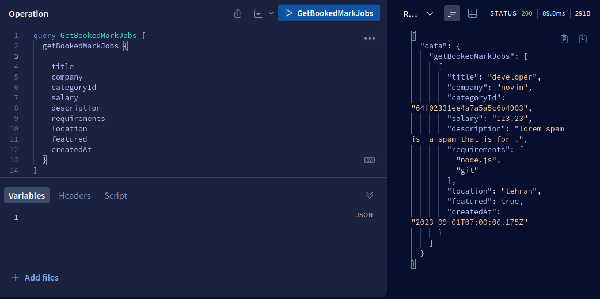

# JobHunt - Open Source Job Board Platform in TypeScript

JobHunt is an open-source job board platform that enables employers to post job listings and job seekers to search and apply for jobs. The platform is built using Express.js and GraphQL, making it efficient and flexible for managing job-related interactions. This repository contains the source code for JobHunt, and we welcome contributions from the community to enhance its features and capabilities.

## Features

- **Employer Dashboard:** Employers can easily create accounts, log in, and post job listings.
- **Job Seeker Profile:** Job seekers can create profiles, search for jobs, and apply using their profiles.
- **Job Listings:** Display job with detailed descriptions, requirements, and application instructions.
- **Application Tracking:** Employers can track and manage job applications through the dashboard.
- **GraphQL API:** Utilize a powerful GraphQL API for seamless job listing retrieval and user interactions.
- **Open Source:** JobHunt is open source, allowing you to customize and contribute to its development.
- **Refresh Token:** JobHunt is featured by refresh token to enhance user experience.

## Installation

Follow these steps to set up and run JobHunt locally on your machine:

Clone the repository:

```bash
git clone https://github.com/BaseMax/JobHuntTS.git
```

Navigate to the project directory:

```bash
cd JobHuntTS
```

Install dependencies:

```bash
npm install
```

Configure environment variables:

Rename `.env.example` to `.env` and fill in your environment variables.

Run the development server:

```bash
tsc

npm run dev
```

Open your browser and visit `http://localhost:4000` to access JobHunt.

## GraphQL

| Type         | Name                      | Description                                     | Example                                                                   |
| ------------ | ------------------------- | ----------------------------------------------- | ------------------------------------------------------------------------- |
| **Mutation** | `createJob`               | Create a new job .                              |                                 |
| **Query**    | `getJobs`                 | Get a list of all available jobs.               |                            |
| **Query**    | `getJobById`              | Get details of a specific job by its ID.        |                             |
| **Query**    | `getJobByTitle`           | Search for jobs by title.                       |                      |
| **Query**    | `getJobByCategory`        | Filter jobs by category.                        |               |
| **Query**    | `getFeaturedJobs`         | Get a list of featured job listings.            |                    |
| **Query**    | `getUserApplications`     | Get user applications...                        |            |
| **Mutation** | `updateJob`               | Update details of an existing job .             |                                 |
| **Mutation** | `deleteJob`               | delete an existing job .                        |                                 |
| **Mutation** | `applyForJob`             | Apply for a job using user's profile.           |                             |
| **Mutation** | `withdrawApplication`     | Withdraw a job application by its ID.           |             |
| **Mutation** | `acceptApplication`       | Accept a job application for a job              |                  |
| **Mutation** | `rejectApplication`       | Reject a job application for a job.             |                 |
| **Mutation** | `signUp`                  | Create a new user profile.                      |                                       |
| **Query**    | `getApplications`         | Get all job applications for a job listing.     |                     |
| **Mutation** | `updateUserProfile`       | Update user profile                             |                |
| **Mutation** | `deleteUserProfile`       | Delete a user profile by its ID.                |                |
| **Query**    | `getUserProfiles`         | Get a list of all registered users.             |                    |
| **Query**    | `getCategories`           | Get a list of all available job categories.     |                         |
| **Mutation** | `createCategory`          | Create a new job category.                      |                       |
| **Mutation** | `updateCategory`          | Update a job category's details.                |                       |
| **Mutation** | `deleteCategory`          | Delete a job category by its ID.                |                      |
| **Query**    | `getSimilarJobs`          | Get a list of jobs similar to a given job.      |                      |
| **Query**    | `getRecentJobs`           | Get a list of recently posted job listings.     |                        |
| **Query**    | `getJobCountByCategory`   | Get the number of jobs in a specific category.  |      |
| **Mutation** | `addBookmark`             | Add a job to a user's bookmarks.                |                            |
| **Mutation** | `removeBookmark`          | Remove a job from a user's bookmarks.           |            |
| **Query**    | `getBookmarkedJobs`       | Get a list of jobs bookmarked by a user.        |               |
| **Query**    | `getUserBookmarkCount`    | Get the number of bookmarks for a user.         |          |
| **Mutation** | `createReview`            | Create a review for a specific a job.           |                           |
| **Mutation** | `updateReview`            | Update a review's content or rating.            |                           |
| **Mutation** | `deleteReview`            | Delete a review by its ID.                      |                           |
| **Query**    | `getReviewsForJob`        | Get all reviews for a specific job .            |                 |
| **Query**    | `getTopCategories`        | Get the most popular job categories.            |                  |
| **Query**    | `getJobsWithApplications` | Get a job and count of associated applications. |  |
| **Query**    | `getOpenApplications`     | Get a list of open job applications.            |            |

## GraphQL Schema

```graphql
type Job {
  id: ID!
  title: String!
  company: String!
  category: String!
  salary: Float
  description: String!
  requirements: [String]
  location: String
  featured: Boolean
  applications: [Application]
  reviews: [Review]
}

type User {
  id: ID!
  username: String!
  email: String!
  bio: String
  applications: [Application]
  bookmarks: [Job]
  reviews: [Review]
}

type Application {
  id: ID!
  user: User!
  job: Job!
  status: String!
  createdDate: String!
}

type Review {
  id: ID!
  user: User!
  job: Job!
  rating: Int!
  content: String!
}

type Category {
  id: ID!
  name: String!
  jobs: [Job]
}

type Bookmark {
  id: ID!
  user: User!
  job: Job!
}

type JobCountByCategory {
  category: String!
  count: Int!
}

type CategoryWithJobCount {
  id: ID!
  name: String!
  jobCount: Int!
}

type ApplicationWithStatus {
  id: ID!
  user: User!
  job: Job!
  status: String!
}

type JobWithApplications {
  id: ID!
  title: String!
  applicationCount: Int!
}

type ApplicationStatus {
  status: String!
  count: Int!
}

type ReviewWithAuthor {
  id: ID!
  rating: Int!
  content: String!
  helpfulCount: Int!
  unhelpfulCount: Int!
  user: User!
}

type UserWithBookmarks {
  id: ID!
  username: String!
  bookmarkCount: Int!
}

type Query {
  getJobs: [Job]
  getJobById(id: ID!): Job
  getJobByTitle(title: String!): [Job]
  getJobByCategory(category: String!): [Job]
  getFeaturedJobs: [Job]
  getUserProfile(username: String!): User
  getUserApplications(userID: ID!): [Application]
  getCategories: [Category]
  getUsers: [User]
  getApplications(jobID: ID!): [Application]
  getSimilarJobs(jobID: ID!): [Job]
  getRecentJobs: [Job]
  getJobCountByCategory(category: String!): Int
  getBookmarkedJobs(userID: ID!): [Job]
  getReviewsForJob(jobID: ID!): [Review]
  getTopCategories(limit: Int!): [CategoryWithJobCount]
  getUserBookmarkCount(userID: ID!): Int
  getJobsWithApplications: [JobWithApplications]
  getOpenApplications: [ApplicationWithStatus]
  getReviewFeedbackByID(id: ID!): ReviewFeedback
  getReviewFeedbackForReview(reviewID: ID!): [ReviewFeedback]
  getReviewByID(id: ID!): Review
  getReviewByRating(rating: Int!): [Review]
  getReviewByAuthor(userID: ID!): [Review]
  getCategoryByID(id: ID!): Category
  getCategoryByName(name: String!): Category
  getCategoriesWithJobs: [CategoryWithJobCount]
  getJobsWithCategories: [JobWithCategories]
  getUsersWithReviews: [UserWithReviews]
  getReviewsWithFeedback: [ReviewWithAuthor]
  getUsersWithApplicationsAndBookmarks: [UserWithBookmarks]
  getApplicationsWithUserAndJob: [ApplicationWithStatus]
}

type Mutation {
  createJobListing(input: CreateJobInput!): Job
  updateJobListing(id: ID!, input: UpdateJobInput!): Job
  deleteJobListing(id: ID!): Job
  applyForJob(jobID: ID!, userID: ID!): Application
  withdrawApplication(applicationID: ID!): Application
  createUserProfile(input: CreateUserInput!): User
  updateUserProfile(userID: ID!, input: UpdateUserInput!): User
  deleteUserProfile(userID: ID!): User
  acceptApplication(applicationID: ID!): Application
  rejectApplication(applicationID: ID!): Application
  createCategory(name: String!): Category
  updateCategory(id: ID!, name: String!): Category
  deleteCategory(id: ID!): Category
  addBookmark(userID: ID!, jobID: ID!): Bookmark
  removeBookmark(userID: ID!, jobID: ID!): Bookmark
  createReview(jobID: ID!, userID: ID!, rating: Int!, content: String!): Review
  updateReview(reviewID: ID!, content: String!): Review
  deleteReview(reviewID: ID!): Review
  createApplication(userID: ID!, jobID: ID!): Application
  updateApplication(
    applicationID: ID!
    input: UpdateApplicationInput!
  ): Application
  deleteApplication(applicationID: ID!): Application
  updateApplicationStatus(applicationID: ID!, status: String!): Application
  createReviewFeedback(
    reviewID: ID!
    userID: ID!
    helpful: Boolean!
  ): ReviewFeedback
  updateReviewFeedback(id: ID!, helpful: Boolean!): ReviewFeedback
  deleteReviewFeedback(id: ID!): ReviewFeedback
  createBookmark(userID: ID!, jobID: ID!): Bookmark
  deleteBookmark(id: ID!): Bookmark
}

input CreateJobInput {
  title: String!
  company: String!
  category: String!
  salary: Float
  description: String!
  requirements: [String]
  location: String
  featured: Boolean
}

input UpdateJobInput {
  title: String
  company: String
  category: String
  salary: Float
  description: String
  requirements: [String]
  location: String
  featured: Boolean
}

input CreateUserInput {
  name: String!
  email: String!
}

input UpdateUserInput {
  name: String
  email: String
}

input UpdateApplicationInput {
  status: String
}
```

## Contributing

We encourage contributions from the open-source community to make JobHunt even better. Here's how you can contribute:

- Fork the repository.
- Create a new branch for your feature or bug fix:

```bash
git checkout -b <feature-name>
```

- Make your changes and commit them with descriptive commit messages.
- Push your changes to your forked repository.
- Create a pull request (PR) to the main branch of the JobHunt repository.

## Feedback and Support

If you encounter any issues or have suggestions for improvements, please open an issue. For general inquiries and discussions, join our community Discord server.

## License

JobHunt is open-source software released under the GPL-3.0 License.

Copyright 2023, Max Base
